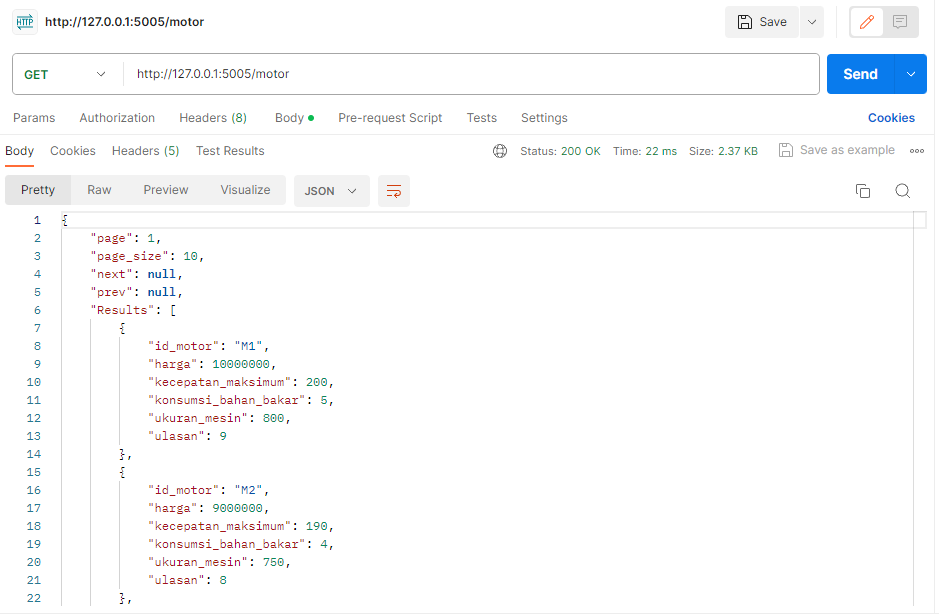
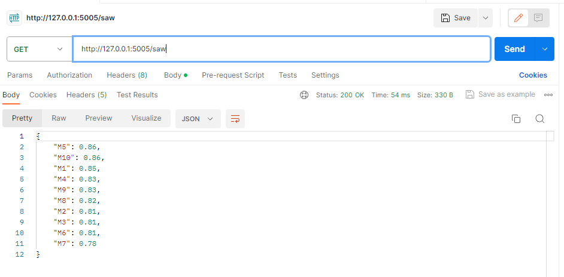
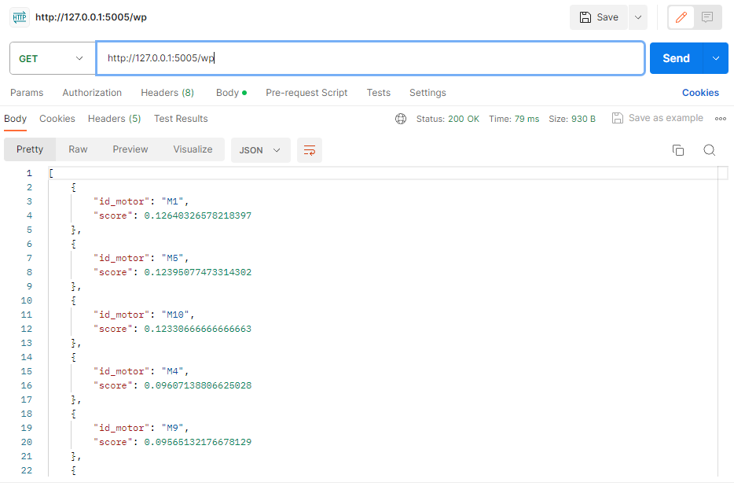
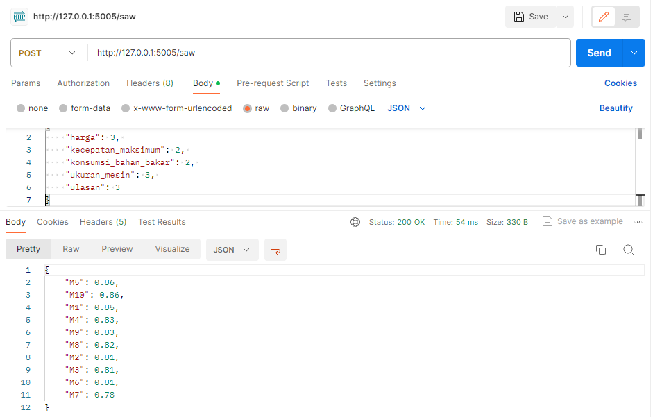
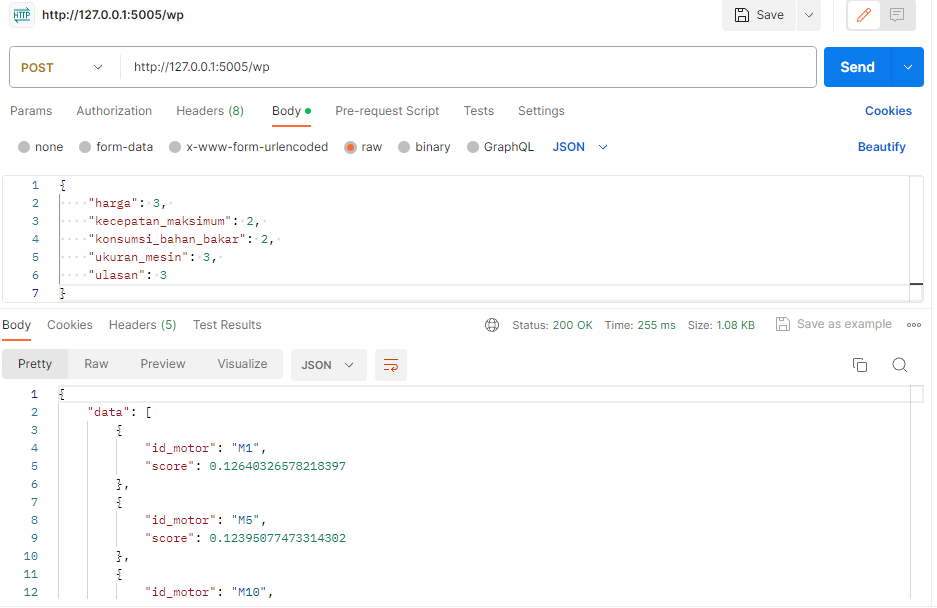

# UAS spk_web

## Install requirements

    pip install -r requirements.txt

## Run the app
to run the web app simply  use

    python main.py

## Usage
Install postman 
https://www.postman.com/downloads/

get motor list

get recommendations saw

get recommendations wp

### TUGAS UAS
Implementasikan model yang sudah anda buat ke dalam web api dengan http method `POST`

INPUT:
	{
		"harga": 3, 
		"kecepatan_maksimum": 2, 
		"konsumsi_bahan_bakar": 2, 
		"ukuran_mesin": 3, 
		"ulasan": 3
	}

OUTPUT (diurutkan / sort dari yang terbesar ke yang terkecil):

post recommendations saw

post recommendations wp

